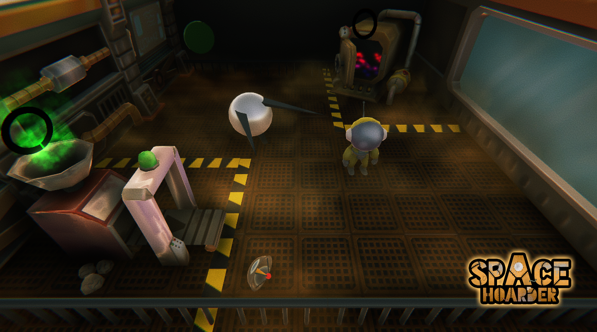
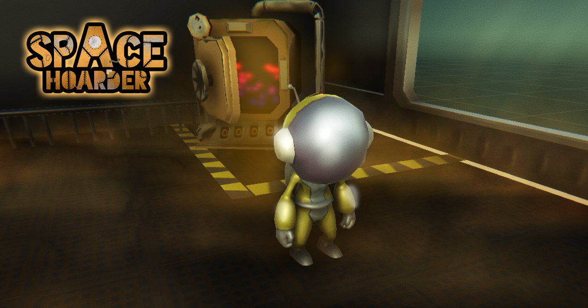
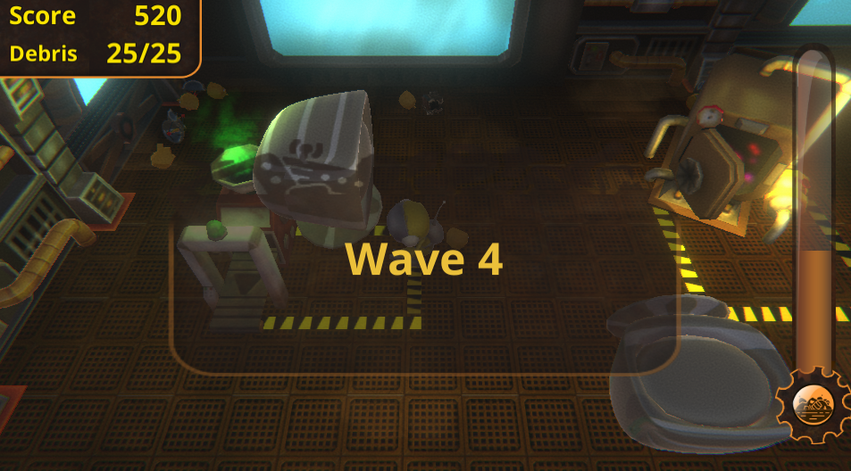

# Space Hoarder

**Space is running out, literally…**  
For a large junkyard ship to escape from a space anomaly, you must get rid of all extra weight that’s no longer useful, and it is a LOT. Be fast enough to compact and incinerate the wreckage that comes at you and avoid getting buried.

Space Hoarder is our game for the [**Ludum Dare 42**](https://ldjam.com/events/ludum-dare/42) #LDJAM #LDJAM42 occurred in August 2018.

  
  

## Downloads and Links

You can play it in your browser.  
**Windows Builds**  and **HTML5 (web)** [gamejolt.com/games/spacehoader/361151](https://gamejolt.com/games/spacehoader/361151)

  
  

## COMMANDS

**Move** *WASD* or *ARROWS*  
**Grab** *J* or *Z*  
**Push** *X*, *K*, or *SPACE*  

Or play it with your *Game Controller*!

## Ludum Dare?

[Ludum Dare](https://ldjam.com) is one of the world's largest and longest running Game Jam events. Every 4 months, we challenge creators to make a game from scratch in a weekend.

[Space Hoarder in Ludum Dare #42](https://ldjam.com/events/ludum-dare/42/space-hoarder)

## Authors

Dalton Lima @daltonbr  
Florencio @wflorencio  
Michael Oliveira @michael-oliveira  
Leandro Dotta @leandro-dotta  
Victorlb @vicotrlb
Ricardo Silva @cavalsilva
